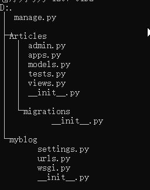
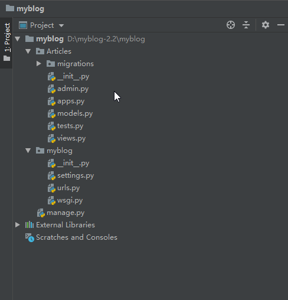
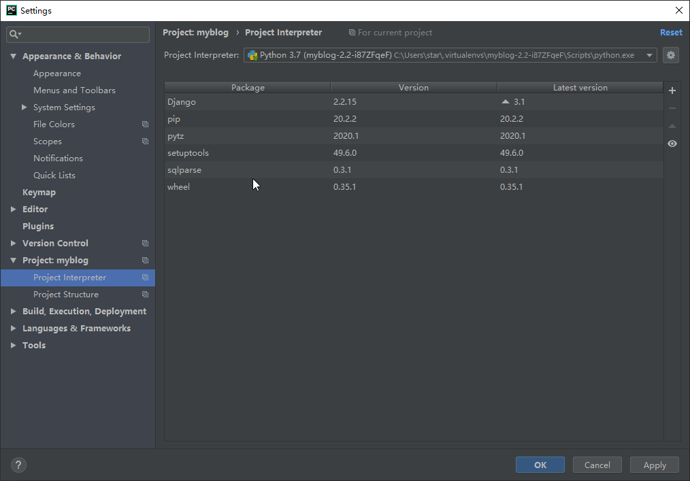

# Django 建 blog手记

## 开发环境及工具

**开发环境及开发工具**

- **OS：**Windows 10 64bit
- **Python：**v3.7.6
- **Django：**v2.2.14
- **Database：**Mariadb 10.2
- **Web前端框架：**Bootstrap 4.0
- **IDE：**Pycharm 2018.3.5
- **DB管理软件：**Navicat Premium 12
- **Markdown软件：**Typora
- **其他Python及Django第三方库**
  - pipenv
  - pillow
  - django-imagekit
  - django-taggit


## 配置开发环境

安装python及数据库等略过。

### 安装pipenv、django2.2.X

1. 在d盘建立文件夹myblog-2.2

2. 安装pipenv

3. 进入myblog-2.2文件夹创新虚拟开发环境

4. 在虚拟环境中安装最新版本Django2.2.x

   ```powershell
   cd d:
   mkdir myblog-2.2
   pip install pipenv
   cd myblog-2.2
   pipenv shell
   pip install django~=2.2
   ```

### 创建Django项目及app

紧接上节开始创建项目和APP

1. 在d:\myblog-2.2运行 *django-admin startproject myblog* 创建项目：**myblog**

2. 进入刚才创建的项目myblog文件夹。

3. 创建app：Articles

   ```powershell
   django-admin startproject myblog
   cd myblog
   python manage.py startapp Articles
   ```


已上完成了项目及app的创建，当用tree命令显示目录树结果将如下图



### 使用Pycharm开发

启动Pycharm打开项目根文件夹，如下图。



配置Pycharm的Interpreter,使用快捷键**ctrl+alt+s**打开setting界面，找到Project: mylog下的Project Interpreter, 选择对应的pipenv环境。



### 创建各类文件夹及Bootstrap文件拷贝到项目中

在项目根目录中的创建以下几个文件夹

- **static：** 存放各类css、js文件主要有bootstrap及jQuery等前端框架的文件。

- **templates：**存放模板文件。

- **media：**存放图片文件。

  

建好以上文件夹后把Bootstrap及jQuery的css及js拷贝到static文件夹下。

依据上面的步骤基本已配置好开发环境，下一步我们就可以正式开始开发。


## 修改blog/setting.py文件

### 增加articles到INSTALLED_APPS中

在pycharm打开blog/setting.py文件，在INSTALLED_APPS列表中把上节创建的app 'articles'加上。

```python
INSTALLED_APPS = [
    'django.contrib.admin',
    'django.contrib.auth',
    'django.contrib.contenttypes',
    'django.contrib.sessions',
    'django.contrib.messages',
    'django.contrib.staticfiles',

    'articles',
]
```

### 把语言改为简体中文及修改时区为亚洲/上海。

```python
# Internationalization
# https://docs.djangoproject.com/en/2.2/topics/i18n/

# LANGUAGE_CODE = 'en-us'
#
# TIME_ZONE = 'UTC'

LANGUAGE_CODE ='zh-hans'

TIME_ZONE = 'Asia/Shanghai'

USE_I18N = True

USE_L10N = True

# USE_TZ = True
USE_TZ = False
```

### 设置模板文件配对路径

设置模板文件配对路径的TEMPLATES的DIRS加上代码： os.path.join(BASE_DIR, 'templates'),

```python
TEMPLATES = [
    {
        'BACKEND': 'django.template.backends.django.DjangoTemplates',
        'DIRS': [
            os.path.join(BASE_DIR, 'templates'),
        ],
        'APP_DIRS': True,
        'OPTIONS': {
            'context_processors': [
                'django.template.context_processors.debug',
                'django.template.context_processors.request',
                'django.contrib.auth.context_processors.auth',
                'django.contrib.messages.context_processors.messages',
            ],
        },
    },
]

```

### 设置STATIC及MEDIA

在blog/setting.py文件的最后设置STATIC和MEDIA

```python
# Static files (CSS, JavaScript, Images)
# https://docs.djangoproject.com/en/2.2/howto/static-files/

STATIC_URL = '/static/'
STATIC_FILES_DIRS = [os.path.join(BASE_DIR, 'static'), ]

MEDIA_URL = '/media/'
MEDIA_ROOT = os.path.join(BASE_DIR, 'media')

```


## Actricles建模

### 文章分类-Category类

打开acrticles下的modles.py文件创建Category类。

```python
class Category(models.Model):
    name = models.CharField('文章分类', max_length=50)
    description = models.CharField('分类描述', max_length=400)

    class Meta:
        verbose_name = verbose_name_plural = '分类'

    def __str__(self):
        return self.name
```

| 字段        | 说明     | 长度 |
| ----------- | -------- | ---- |
| name        | 文章分类 | 50   |
| description | 描述     | 400  |

### 安装django-taggit插件

利用django-taggit插件做为标签类，打开命令行，激活开发环境安装此插件。

pip install django-taggit

